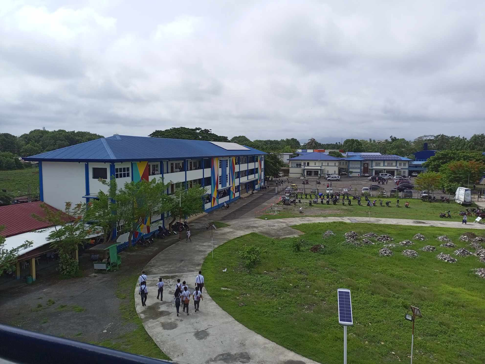
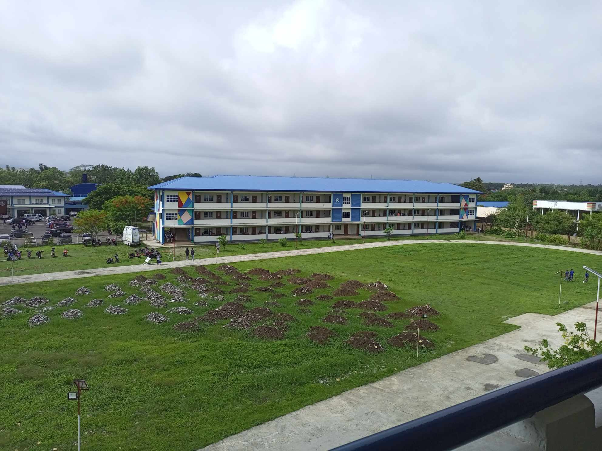

<!DOCTYPE html>
<html lang="en">
<head>
    <meta charset="UTF-8">
    <title>BSCS-2A</title>
    <link rel="stylesheet" href="https://cdnjs.cloudflare.com/ajax/libs/font-awesome/6.4.2/css/all.min.css" integrity="sha512-z3gLpd7yknf1YoNbCzqRKc4qyor8gaKU1qmn+CShxbuBusANI9QpRohGBreCFkKxLhei6S9CQXFEbbKuqLg0DA==" crossorigin="anonymous" referrerpolicy="no-referrer" />
    
</head>
<body>
    

    

        
        
    

    

        

        

        

        

    

    

        <a href="#info" class="a">Info</a>
        <a href="#officers" class="a">Officers</a>
        <a href="#students" class="a">Students</a>
        <a href="#others" class="a">Others</a>
    

    

    

    
    

    

        <h2>INFO</h2>
        

            Tanauan Institute (TI), Inc. is a private higher educational institution in Batangas. It is owned by the Collantes Family and located at J. Gonzales, Barangay 4, Tanauan City Batangas.
        

        

            This private school offer Elementary, Junior High School, Senior High School and College Education.
        

        

            <h3>• Mission</h3>
            

                Tanauan Institute, Inc. seeks to establish a culture of intellectual competence, environmental awareness and socio civic responsibility. Tanauan Institute, Inc. commits itself to the formation of disciplined and enlightened minds. Tanauan Institute, Inc. aims to help build a nation of great men and women who shall be accomplished and decorated in their fields.
            

        

        

            <h3>• Vision</h3>
            

                Tanauan Institute, Inc. envision itself to be a world class institution dedicated to the higher learning and modern research. It hopes to contribute to the humane and holistic development of the Filipino youth through top tier quality education. Tanauan Institute, Inc. strives to produce socially and morally upright individual in globally competitive environment.
            

        

        

            <h3>• Preamble</h3>
            

                We, the sovereign Filipino people, imploring the aid of Almighty God, in order to build a just and humane society, and establish a Government that shall embody our ideals and aspirations, promote the common good, conserve and develop our patrimony, and secure to ourselves and our posterity, the blessings of independence and democracy under the rule of law and a regime of truth, justice, freedom, love, equality, and peace, do ordain and promulgate this Constitution.
            

        

        
         
    

    
    

        <h2 class="heading-officers">BSCS-2A OFFICERS</h2>
        

            

                
                
Bernadette Ramos President

            

            

                
                
Lorenz De Vera Vice President

            

            

                
                
Kristel Anne Sarmiento Secretary

            

            

                
                
Kriztel Anne Solis Treasurer

            

            

                
                
Tristan Bajamundi Auditor

            

        

    

    
    

        <h2>Aspiring Developers</h2>
        
This section should be the list of my classmates in BSCS-2A, but I'm lazy enough to put their names. PS, the height of this section is auto, so i can add as many names as I want without losing the layout. Imma put names maybe next time.

        
Another one, I will change this section from paragraph to ul li, so that there will be a clear view to the list of names. That's all

    

    
    

        <h2>About</h2>
        

            

                &nbsp<i class="fa-solid fa-location-dot"></i>&nbsp&nbspJ. Gonzales, Barangay 4, Tanauan, 4232 Batangas
            

             
            

                <i class="fa-solid fa-clock"></i> &nbspDaily • Closes 5 PM
            

             
            

                <i class="fa-solid fa-phone"></i>  (043) 778 1742
            

        

        
        

            Developer's Info
            Ivan
            PS: not responsive. tinatamad na ako
            Hello kay ano hehe
            
        

        

        

    

</body>

</html>
